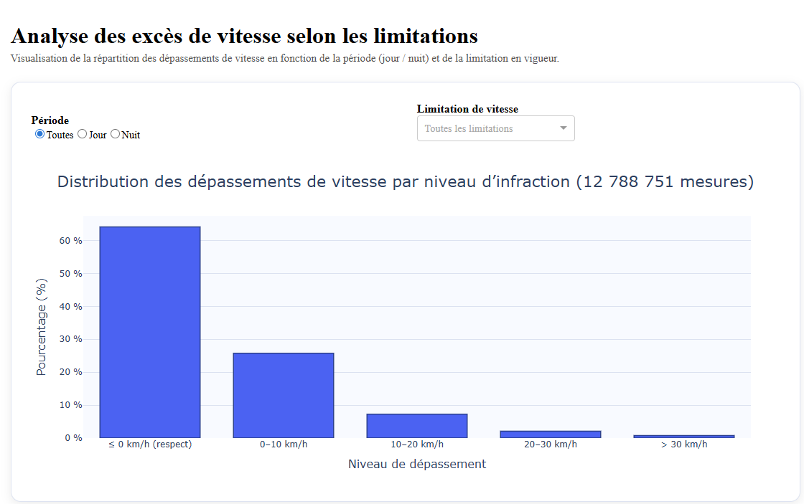
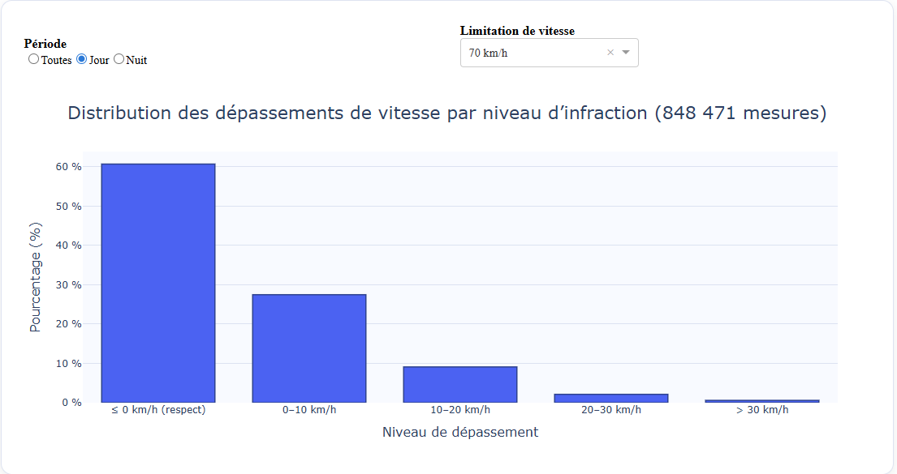
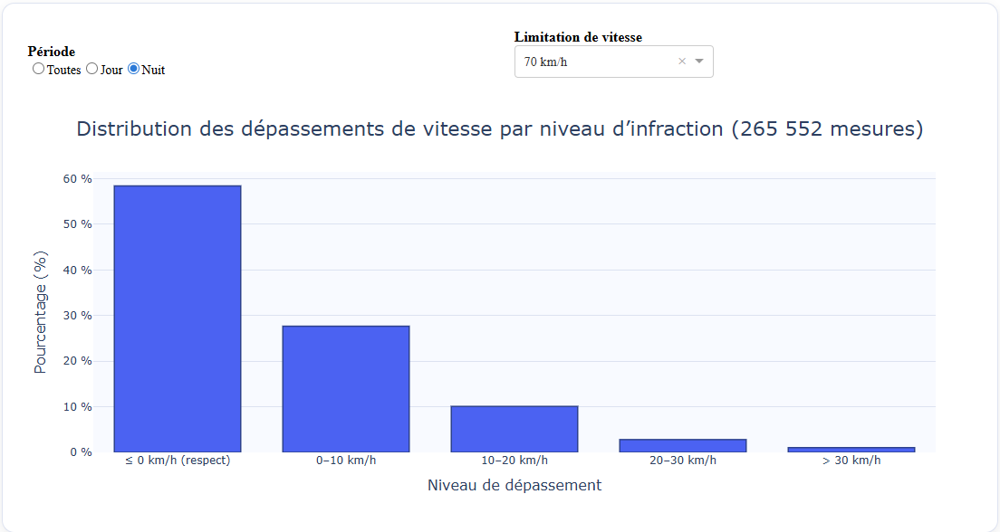
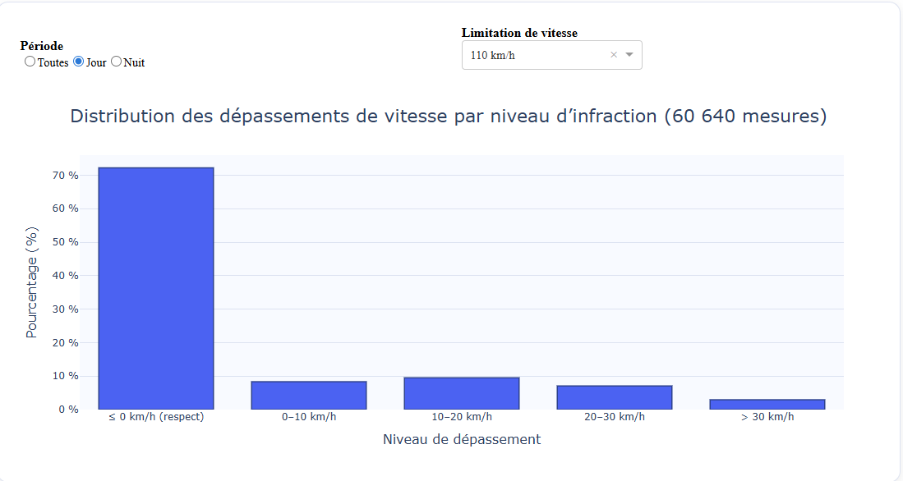
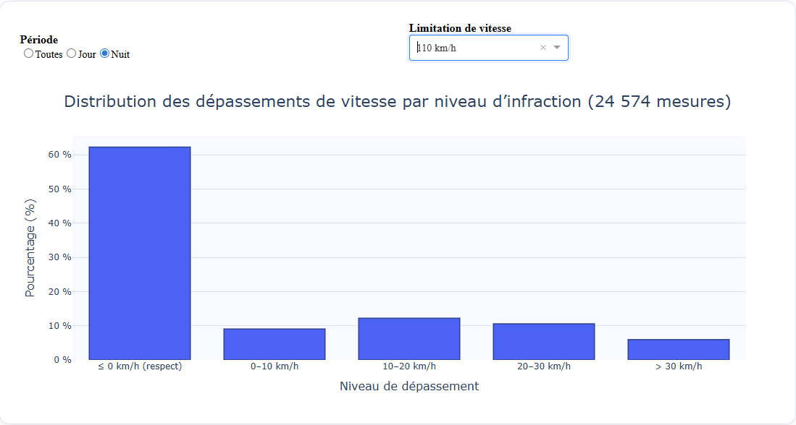
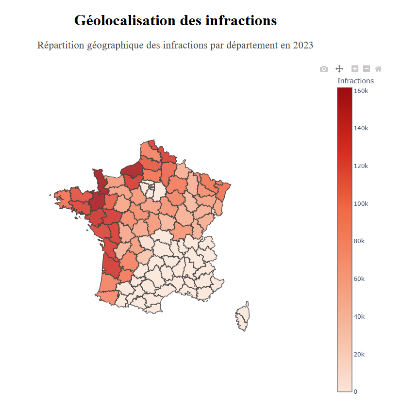

# Radar Dashboard

Tableau de bord d'analyse des excès de vitesse détectés par les radars automatiques en France en 2023.

---

## User Guide

### Installation

**Prérequis :**
- Python 3.10 minimum
- Connexion internet (pour le premier lancement)
- 2 Go d'espace disque

**Étapes d'installation :**

```bash
# 1. Cloner le projet
git clone https://github.com/adam-nouari/DataProject.git
cd DataProject

# 2. Créer l'environnement virtuel
python -m venv .venv

# 3. Activer l'environnement
# Sur Windows :
.venv\Scripts\activate
# Sur Linux/Mac :
source .venv/bin/activate

# 4. Installer les dépendances
pip install -r requirements.txt

# 5. Lancer le dashboard
python main.py
```

### Premier lancement

**Important :** Le premier lancement prend environ **15 minutes**. Le script va automatiquement :

1. Télécharger les données depuis Data.gouv.fr (~670 Mo)
2. Nettoyer les données
3. Créer une base SQLite (~12 millions de lignes)
4. Calculer les périodes jour/nuit avec les données astronomiques
5. Générer les fichiers d'agrégation pour le dashboard

Une fois cette étape terminée, le dashboard se lance et s'ouvre dans votre navigateur à l'adresse :

**http://127.0.0.1:8050/**

Les fois suivantes, le lancement est quasi-instantané (moins de 5 secondes) car les données sont déjà préparées.

### Navigation

Le dashboard contient 4 pages :

- **Accueil** : Page d'accueil
- **Dashboard** : Graphiques statistiques interactifs avec filtres
- **Géolocalisation** : Carte des infractions par département
- **À propos** : Informations sur le projet

Pour arrêter le serveur : `Ctrl+C` dans le terminal.

---

## Data

### Source des données

**Jeu de données officiel :**  
[Vitesses relevées par les radars automatiques - Data.gouv.fr](https://www.data.gouv.fr/fr/datasets/jeux-de-donnees-des-vitesses-relevees-par-les-voitures-radars-a-conduite-externalisee/)

**Fichier utilisé :**  
`opendata-vitesses-pratiquees-voitures-radars-2023-01-01-2023-12-31.csv`

**Caractéristiques :**
- Volume : ~12,8 millions de mesures
- Période : Année 2023 complète
- Couverture : France métropolitaine
- Taille : 667 Mo (fichier brut)

### Colonnes du dataset

| Colonne | Description | Type |
|---------|-------------|------|
| `date` | Date et heure de la mesure | datetime |
| `position` | Coordonnées GPS (latitude longitude) | string |
| `mesure` | Vitesse mesurée en km/h | int |
| `limite` | Limitation de vitesse en vigueur | int |

**Colonne calculée :**
- `periode` : Période jour/nuit (calculée automatiquement via la bibliothèque Astral)

### Pipeline de traitement

Le script `main.py` orchestre automatiquement toutes les étapes :

```
1. get_data.py
   └─> Télécharge le CSV brut depuis Data.gouv.fr
   └─> Stocke dans data/raw/

2. clean_data.py
   └─> Renomme les colonnes (mesure → vitesse_mesuree, limite → limitation)
   └─> Supprime les lignes avec valeurs manquantes
   └─> Stocke dans data/cleaned/

3. load_to_sqlite.py
   └─> Crée la base SQLite
   └─> Calcule les heures de lever/coucher du soleil (API Astral)
   └─> Détermine si chaque mesure est de jour ou de nuit
   └─> Stocke dans data/database/vitesses.db

4. build_dashboard_cache.py
   └─> Calcule les statistiques agrégées par période/limitation/classe
   └─> Génère vitesses_agg_2023.csv

5. build_radars_departements.py
   └─> Fait une jointure spatiale entre les coordonnées GPS et les départements
   └─> Calcule le nombre d'infractions par département
   └─> Génère infractions_par_dept_agg.csv
```

### API externe : Calcul astronomique

Pour déterminer si une mesure a été prise de jour ou de nuit, j'utilise la bibliothèque **[Astral](https://astral.readthedocs.io/)**.

Pour chaque position GPS et chaque date, Astral calcule les heures exactes de lever et coucher du soleil. Si la mesure a été prise entre ces deux heures, c'est considéré comme "jour", sinon "nuit".

**Optimisation :** Pour éviter de faire 12 millions de calculs, j'arrondis les coordonnées GPS à 0,1° près et je calcule seulement pour les combinaisons uniques (date + position arrondie).

---

## Developer Guide

### Architecture du projet

```
DataProject/
├── main.py                          # Point d'entrée, lance tout automatiquement
├── requirements.txt                 # Dépendances Python
├── README.md
├── video.mp4                        # Vidéo de démonstration
│
├── data/                            # Données (généré automatiquement)
│   ├── raw/                         # CSV brut téléchargé
│   ├── cleaned/                     # CSV nettoyé + agrégations
│   ├── database/                    # Base SQLite
│   └── geo/                         # GeoJSON des départements
│
├── images/                          # Captures d'écran
│
├── src/
│   ├── components/                  # Composants réutilisables de l'interface
│   │   ├── header.py               # En-tête du dashboard
│   │   ├── navbar.py               # Barre de navigation
│   │   └── footer.py               # Pied de page
│   │
│   ├── pages/                       # Pages du dashboard
│   │   ├── home.py                 # Application principale + routage
│   │   ├── simple_page.py          # Page avec graphiques statistiques
│   │   └── create_geo_loc.py       # Page avec carte choroplèthe
│   │
│   └── utils/                       # Scripts de traitement des données
│       ├── get_data.py             # Téléchargement depuis Data.gouv.fr
│       ├── clean_data.py           # Nettoyage du CSV
│       ├── load_to_sqlite.py       # Import vers SQLite + calcul périodes
│       ├── build_dashboard_cache.py        # Agrégations pour le dashboard
│       └── build_radars_departements.py    # Statistiques par département
│
└── tests/                           # Tests unitaires (pytest)
```

### Comment ajouter une nouvelle page

**Exemple : ajouter une page "Statistiques avancées"**

**Étape 1 : Créer le fichier de la page**

Créer `src/pages/stats_avancees.py` :

```python
from dash import html

layout = html.Div([
    html.H2("Statistiques avancées"),
    html.P("Contenu de ma nouvelle page..."),
])
```

**Étape 2 : Ajouter la route dans home.py**

Ouvrir `src/pages/home.py` et modifier la section des imports :

```python
# Ajouter cet import
from src.pages.stats_avancees import layout as layout_stats_avancees
```

Puis dans la fonction `create_app()`, modifier le dictionnaire `routes` :

```python
routes = {
    "/": lambda: html.Div([...]),
    "/simple": lambda: layout_stats,
    "/complex": lambda: layout_geo,
    "/stats-avancees": lambda: layout_stats_avancees,  # Nouvelle route
    "/about": lambda: html.Div([...]),
}
```

**Étape 3 : Ajouter le lien dans la navbar**

Ouvrir `src/components/navbar.py` et modifier la liste `liens` :

```python
liens = [
    ("Accueil", "/"),
    ("Dashboard", "/simple"),
    ("Géolocalisation", "/complex"),
    ("Stats avancées", "/stats-avancees"),  # Nouveau lien
    ("À propos", "/about"),
]
```

C'est tout ! La nouvelle page est maintenant accessible via le menu.

### Comment ajouter un nouveau graphique

**Exemple : ajouter un graphique dans simple_page.py**

1. Charger les données (déjà fait au début du fichier)
2. Créer un nouveau composant `dcc.Graph` dans le `layout`
3. Si le graphique est interactif, créer un callback dans la fonction `register_callbacks(app)`

**Exemple de callback :**

```python
@app.callback(
    Output("mon-graphique", "figure"),
    Input("mon-filtre", "value"),
)
def mettre_a_jour_graphique(valeur_filtre):
    # Filtrer les données
    df_filtre = donnees[donnees["colonne"] == valeur_filtre]
    
    # Créer le graphique avec Plotly
    fig = px.bar(df_filtre, x="x", y="y")
    
    return fig
```

### Technologies utilisées

**Frontend :**
- Dash 3.3.0 (framework web Python)
- Plotly (graphiques interactifs)

**Backend :**
- Python 3.12
- SQLite (base de données)
- Pandas (manipulation de données)
- GeoPandas (données géospatiales)

**Bibliothèques spécifiques :**
- Astral : calculs astronomiques (lever/coucher du soleil)
- Shapely : géométries spatiales
- tqdm : barres de progression

**Tests :**
- pytest (framework de tests)

---

## Rapport d'analyse

### Principaux résultats

**1. La majorité des gens respectent les limitations**

Plus de 60% des conducteurs respectent les limitations de vitesse. C'est encourageant et ça montre que les radars ont un effet dissuasif.



**2. Plus la limite est élevée, plus on dépasse**

Sur les zones à 130 km/h (autoroutes), les gens ont tendance à dépasser beaucoup plus que sur les zones à 50 km/h. Mon hypothèse : à grande vitesse, on sous-estime sa propre vitesse et on se sent plus "en sécurité" pour accélérer un peu.

**3. La nuit, c'est n'importe quoi (surtout sur certaines limitations)**

Sur les zones à 70 km/h :
- **Jour :** Le trafic est dense, les gens font plus attention
- **Nuit :** Routes vides, les conducteurs se lâchent → **+15% d'infractions**

| Jour | Nuit |
|------|------|
|  |  |

Sur les zones à 110 km/h, c'est encore plus marqué la nuit avec une augmentation des grands excès (> 20 km/h).

| Jour | Nuit |
|------|------|
|  |  |

**Conclusion :** La nuit, l'absence de circulation donne un faux sentiment de liberté et pousse aux comportements à risque.

**4. Répartition géographique et limites du dataset**



La carte montre une concentration d'infractions dans l'Ouest et le Nord de la France. **Attention à l'interprétation** : cela ne signifie pas que ces régions sont plus dangereuses ou que les conducteurs y sont moins respectueux.

**Le problème : des départements entiers manquent dans les données.**

En effet, le jeu de données de 2023 ne couvre pas tous les départements français. **L'Île-de-France** (Paris 75, Seine-et-Marne 77, Yvelines 78, Essonne 91, Hauts-de-Seine 92, Seine-Saint-Denis 93, Val-de-Marne 94, Val-d'Oise 95) et une grande partie du **Sud-Est** (Bouches-du-Rhône 13, Alpes-Maritimes 06, Var 83, Vaucluse 84, etc.) n'apparaissent pas ou quasiment pas dans le dataset.

J'ai cherché un dataset plus complet qui couvre tous les départements de France, mais je n'en ai pas trouvé pour l'année 2023. Les radars automatiques à conduite externalisée (voitures radars) ne circulent apparemment pas uniformément sur tout le territoire, et certaines régions ne sont tout simplement pas mesurées.

**Conséquence :** La carte reflète avant tout la **couverture géographique du dataset**, pas la réalité des comportements routiers sur l'ensemble du territoire. Les départements avec beaucoup d'infractions sont simplement ceux où il y a eu beaucoup de mesures par les radars mobiles.

---

## Copyright

Je déclare sur l'honneur que le code fourni a été produit par moi-même, **à l'exception des passages ci-dessous** pour lesquels j'ai utilisé de la documentation externe ou des exemples pour des parties techniques complexes.

### Lignes empruntées

**1. Fichier `src/utils/load_to_sqlite.py` (lignes 47-68) :**
```python
def calculer_ephemerides(dates_positions: pd.DataFrame) -> pd.DataFrame:
    resultats = []
    for date, lat, lon in dates_positions.itertuples(index=False, name=None):
        try:
            lieu = LocationInfo(latitude=lat, longitude=lon, 
                              timezone=FUSEAU_HORAIRE.zone)
            ephemerides = sun(lieu.observer, date=date, tzinfo=FUSEAU_HORAIRE)
            resultats.append((date, lat, lon, 
                            ephemerides["sunrise"], 
                            ephemerides["sunset"]))
        except Exception:
            resultats.append((date, lat, lon, pd.NaT, pd.NaT))
    # ...
```
- **Source :** [Documentation officielle Astral](https://astral.readthedocs.io/en/latest/index.html#usage)
- **Raison :** La syntaxe pour utiliser `LocationInfo` et `sun()` est très spécifique. J'ai adapté l'exemple de la documentation pour créer un lieu avec des coordonnées GPS et récupérer les heures de lever/coucher du soleil dans le bon fuseau horaire (Europe/Paris).

**2. Fichier `src/utils/load_to_sqlite.py` (lignes 104-107) :**
```python
try:
    return dt.dt.tz_localize(FUSEAU_HORAIRE, ambiguous="infer", nonexistent="shift_forward")
except Exception:
    return dt.dt.tz_localize(FUSEAU_HORAIRE, ambiguous=False, nonexistent="shift_forward")
```
- **Source :** [Pandas documentation - tz_localize](https://pandas.pydata.org/docs/reference/api/pandas.Series.dt.tz_localize.html)
- **Raison :** Le paramètre `ambiguous="infer"` gère les heures ambiguës lors du passage à l'heure d'hiver (quand 2h du matin existe deux fois). Le `nonexistent="shift_forward"` gère l'heure d'été (quand 2h du matin n'existe pas). J'ai utilisé la doc pandas pour comprendre comment gérer ces cas particuliers.

**3. Fichier `src/pages/create_geo_loc.py` (lignes 38-50) :**
```python
fig = go.Figure(go.Choroplethmapbox(
    geojson=geojson_departements,
    locations=df_complet["code_dept"],
    z=df_complet["nb_infractions"],
    featureidkey="properties.code",
    colorscale=[...],
    marker_opacity=0.85,
    marker_line_width=1.5,
    # ...
))
```
- **Source :** [Plotly Choropleth Mapbox documentation](https://plotly.com/python/mapbox-county-choropleth/)
- **Raison :** La carte choroplèthe avec Mapbox nécessite une syntaxe précise pour lier les données CSV aux polygones du GeoJSON. Le paramètre `featureidkey="properties.code"` permet de faire la correspondance entre le code département dans mon CSV et celui dans le GeoJSON. J'ai suivi l'exemple de la doc Plotly pour comprendre cette syntaxe.

**4. Fichier `src/utils/build_radars_departements.py` (lignes 73-76) :**
```python
df_joint = gpd.sjoin(
    gdf_infractions, 
    gdf_dept[[col_code, "geometry"]], 
    how="left", 
    predicate="within"
)
```
- **Source :** [GeoPandas spatial joins documentation](https://geopandas.org/en/stable/docs/user_guide/mergingdata.html#spatial-joins)
- **Raison :** La jointure spatiale (`sjoin`) avec le prédicat `"within"` permet de déterminer dans quel département se trouve chaque point GPS. C'est une opération complexe de géomatique que je ne connaissais pas avant. J'ai utilisé la documentation GeoPandas pour comprendre comment faire cette correspondance géographique.

**5. Fichier `src/utils/build_radars_departements.py` (lignes 55-61) :**
```python
def convertir_en_geodataframe(df: pd.DataFrame) -> gpd.GeoDataFrame:
    coords = df["position"].str.split(expand=True, n=1)
    coords.columns = ["lat", "lon"]
    coords = coords.apply(pd.to_numeric, errors="coerce")
    geometries = [Point(lon, lat) for lon, lat in zip(df["lon"], df["lat"])]
    return gpd.GeoDataFrame(df, geometry=geometries, crs="EPSG:4326")
```
- **Source :** [GeoPandas creating GeoDataFrame from scratch](https://geopandas.org/en/stable/gallery/create_geopandas_from_pandas.html)
- **Raison :** La conversion d'un DataFrame pandas normal en GeoDataFrame avec des objets géométriques `Point` de Shapely nécessite de comprendre le système de coordonnées `crs="EPSG:4326"` (WGS84). J'ai dû consulter la doc pour savoir comment créer des géométries à partir de coordonnées textuelles.

**6. Fichier `src/utils/build_dashboard_cache.py` (lignes 36-43) :**
```python
bornes = [-float("inf"), 0, 10, 20, 30, float("inf")]
df["classe_depassement"] = pd.cut(
    df["depassement"],
    bins=bornes,
    labels=CLASSES_DEPASSEMENT,
    include_lowest=True,
    right=True,
)
```
- **Source :** [Pandas cut documentation](https://pandas.pydata.org/docs/reference/api/pandas.cut.html)
- **Raison :** La fonction `pd.cut()` permet de créer des catégories à partir de valeurs continues. Les paramètres `include_lowest=True` et `right=True` contrôlent si les bornes sont inclusives ou exclusives. J'ai utilisé la documentation pandas pour comprendre comment gérer correctement les intervalles avec `-float("inf")` et `float("inf")`.

**7. Fichier `src/pages/simple_page.py` (lignes 135-141) :**
```python
comptages = (
    df.groupby("classe_depassement")["count"]
    .sum()
    .reindex(ORDRE_CLASSES, fill_value=0)
)
total = comptages.sum()
pourcentages = (comptages / total * 100).round(2) if total > 0 else [0] * len(ORDRE_CLASSES)
```
- **Source :** [Pandas groupby and reindex](https://pandas.pydata.org/docs/reference/api/pandas.Series.reindex.html)
- **Raison :** Le `.reindex()` avec `fill_value=0` permet de garantir que toutes les classes sont présentes même si elles ont 0 occurrences, ce qui évite les erreurs dans les graphiques. La condition ternaire `if total > 0 else` évite une division par zéro. J'ai trouvé cette technique dans la doc pandas.

**8. Fichier `src/utils/load_to_sqlite.py` (lignes 133-147) :**
```python
for i, bloc in enumerate(pd.read_sql_query(requete, conn, chunksize=TAILLE_BLOC)):
    resultats = calculer_periode_bloc(bloc)
    
    conn.executemany(
        "UPDATE vitesses SET periode=? WHERE rowid=?;",
        [(p, rid) for rid, p in resultats.itertuples(index=False, name=None)]
    )
    conn.commit()
```
- **Source :** [Pandas chunking large queries](https://pandas.pydata.org/docs/user_guide/io.html#querying) et [SQLite executemany](https://docs.python.org/3/library/sqlite3.html#sqlite3.Cursor.executemany)
- **Raison :** Le traitement par blocs (`chunksize`) est nécessaire pour éviter de saturer la RAM avec 12 millions de lignes. L'utilisation de `executemany()` avec une list comprehension permet de faire des updates en masse de manière optimisée. J'ai combiné deux documentations pour trouver cette solution.

**9. Fichier `src/utils/get_data.py` (lignes 22-35) :**
```python
with requests.get(url, stream=True, timeout=600) as reponse:
    reponse.raise_for_status()
    taille_totale = int(reponse.headers.get("Content-Length", 0))
    
    with open(chemin_sortie, "wb") as f, tqdm(
        total=taille_totale,
        unit="B",
        unit_scale=True,
        desc=chemin_sortie.name
    ) as barre_progression:
        for chunk in reponse.iter_content(chunk_size=1024 * 1024):
            if chunk:
                f.write(chunk)
                barre_progression.update(len(chunk))
```
- **Source :** [Requests streaming downloads](https://requests.readthedocs.io/en/latest/user/advanced/#streaming-requests) et [tqdm documentation](https://tqdm.github.io/)
- **Raison :** Le téléchargement en streaming (`stream=True`) avec `iter_content()` évite de charger tout le fichier en mémoire. L'intégration de `tqdm` avec un context manager double (`with ... , tqdm(...)`) pour avoir une barre de progression était compliquée à mettre en place. J'ai suivi les exemples des deux documentations.

**10. Fichier `src/pages/simple_page.py` (lignes 169-183) :**
```python
fig.update_traces(
    marker_color="#4361ee",
    marker_line_color="#27408b",
    marker_line_width=1.5,
    hovertemplate="Niveau : %{x}<br>Pourcentage : %{y:.1f}%<extra></extra>",
)

fig.update_layout(
    title_x=0.5,
    plot_bgcolor="rgba(248, 250, 255, 1)",
    xaxis=dict(showgrid=False, tickangle=0),
    yaxis=dict(gridcolor="rgba(200, 210, 230, 0.6)", zeroline=False),
)
```
- **Source :** [Plotly styling documentation](https://plotly.com/python/styling-plotly-express/) et [Plotly hover text](https://plotly.com/python/hover-text-and-formatting/)
- **Raison :** Le `hovertemplate` avec la syntaxe `%{x}` et `%{y:.1f}%` permet de personnaliser l'info-bulle. Le `<extra></extra>` supprime la boîte noire par défaut. Les couleurs RGBA et les configurations d'axes nécessitent de comprendre la structure des objets Plotly. J'ai passé du temps sur la doc pour avoir un rendu propre.

**11. Fichier `src/utils/load_to_sqlite.py` (lignes 95-108) :**
```python
bloc_enrichi = bloc.merge(
    ephemerides, 
    on=["date_only", "lat_round", "lon_round"], 
    how="left"
)

bloc_enrichi["periode"] = np.where(
    (bloc_enrichi["datetime"] >= bloc_enrichi["sunrise_local"]) & 
    (bloc_enrichi["datetime"] <= bloc_enrichi["sunset_local"]),
    "jour", 
    "nuit"
)
```
- **Source :** [Pandas merge documentation](https://pandas.pydata.org/docs/reference/api/pandas.DataFrame.merge.html) et [NumPy where](https://numpy.org/doc/stable/reference/generated/numpy.where.html)
- **Raison :** La jointure (`merge`) sur plusieurs colonnes avec `how="left"` préserve toutes les lignes même si certaines n'ont pas de correspondance. L'utilisation de `np.where()` avec des conditions multiples combinées par `&` est plus performante qu'un `apply()`. J'ai utilisé les docs pandas et numpy pour optimiser cette partie.

**Toute ligne non déclarée ci-dessus est de ma propre production.**

---

## Liens utiles

- [Dépôt GitHub du projet](https://github.com/adam-nouari/DataProject)
- [Source des données - Data.gouv.fr](https://www.data.gouv.fr/fr/datasets/jeux-de-donnees-des-vitesses-relevees-par-les-voitures-radars-a-conduite-externalisee/)
- [Documentation Dash](https://dash.plotly.com/)
- [Documentation Plotly](https://plotly.com/python/)

---

**Projet réalisé dans le cadre du cours de Data Science — ESIEE Paris (2024-2025)**

**Auteur :** Adam Nouari
